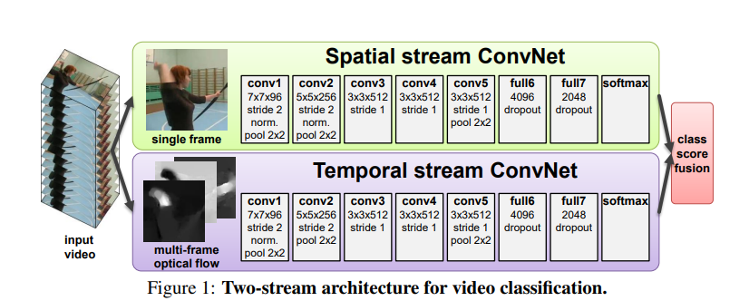
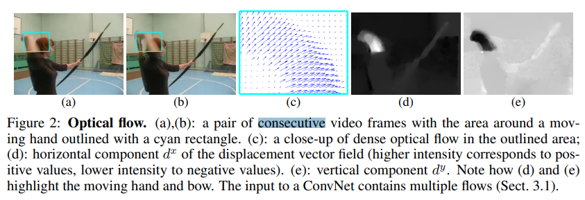
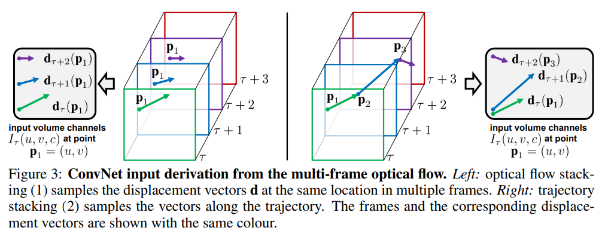
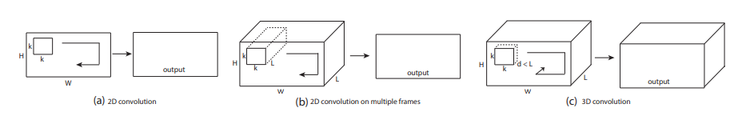
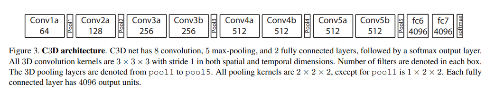

# Video Understanding

## Two-Stream Convolutional Networks for Action Recognition in Videos(2014)
双流网络的模型结构如下：

主要包含两个部分：空间流卷积和时序流卷积。想法其实现在来看比较简单，CNN能够提取2D空间图像特征，但是感知时序的信息比较差。既然不能
很好的处理时序信息，那就把提供抽取好的时序信息喂给模型，然后融合。
### Optical flow ConvNets
光流卷积网络：跟图像卷积网络类似，由于每两个相邻帧就可以构建一张光流图，表示成张量就是一个w*h*2的张量（2表示垂直方向和水平方向的分量）。
具体可以参考下图：图（c）就是蓝色区域的光流图特写。

如何利用这些光流特征：文中作者尝试了两种方式optical flow stacking 和trajectory stacking

optical flow stacking 对于每个像素点(u,v),堆叠当前帧的后L个光流图，构成一个维度为2L的张量，用来表示当前点的光流
trajectory stacking 利用光流对像素点进行追踪，先追踪每个像素点的光流，在进行合并。具体可以参考上图。
虽然第二种方式用来构建光流网络的输入更有启发性，但是两种方案的效果性能相当。

早期关于3维卷积网络的研究，双流网络最致命的缺点就是慢，抽取光流的算法是非常耗费时间的。2D卷积不能很好的提取空间特征
## Learning Spatiotemporal Features with 3D Convolutional Networks(C3D 2015)
2D卷积和3D卷积的简单示例：

为什么2D卷积不能很好的提取空间特征：采用多帧视频，L帧看成L个通道，二维卷积在第一次提取特征过后，
时序信息就已经完全（collapsed completely）坍缩，后续的卷积操作无法再次感知到时序特征

模型结构非常简单

主要结论：1.3D卷积能够更好的建模形状和运动特征 2.使用3*3*3能够达到最好的效果

## Quo Vadis, Action Recognition? A New Model and the Kinetics Dataset(2018)
双流膨胀卷积网络：Two Stream Inflated 3D ConvNet
现有的特征提取方案之间深入分析和对比：
### 

